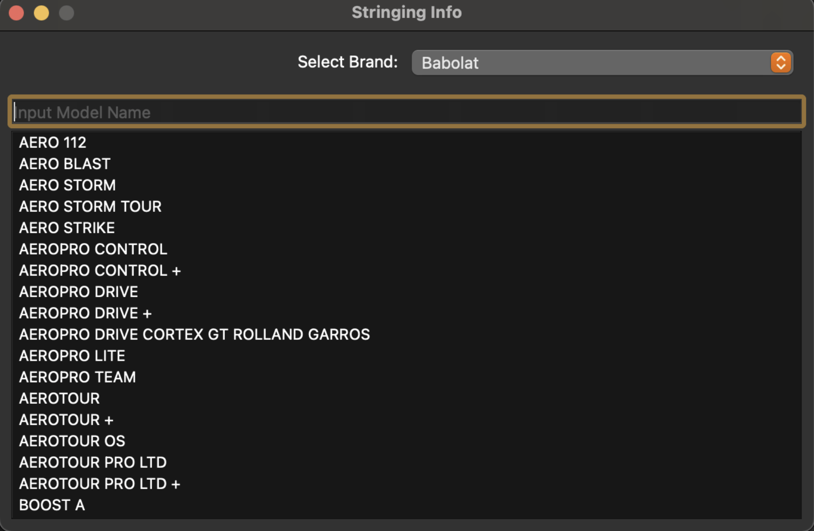

# StringerPro

`A Helpful Desktop Tool When Stringing Tennis Racquets`

## The App

## What is This?

Since I string tennis racquets quite often as a part time job, I often check online various racquet-specific information such as the string pattern, holes to skip, and string length required. I hope to create a small app/script using python which scrapes this data off of the web, and allows me to quickly access this information for each racquet I am handed in real-time.

## Implementation Notes

### Webscraper

The webscaping component of this program is written in Python and utilizes the Beautiful Soup library to access table data from klippermate.com

### Frontend

The gui app component is written in Python and uses the PyQt6 library to display results from a search bar. I found this library very finicky and it looks pretty old-school but hopefully it will be compatible with iOS as well with minimal changes.
